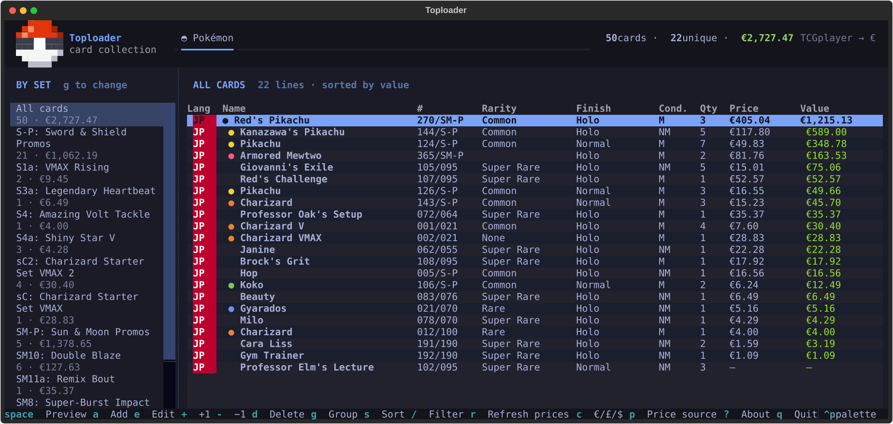

<p align="center">
  
</p>

<p align="center"><b>Your trading card binder, in the terminal.</b><br>
Track Pokémon singles and sealed products, Japanese and international, with live market prices.</p>



## Features

- **One collection, every language.** Japanese and international cards sit side by side,
  each with a language badge (JP, EN, IT…). Group the sidebar by set, language, type,
  rarity, category or condition.
- **Singles and sealed.** Booster boxes, packs, ETBs, promo packs, decks and collection
  boxes are tracked next to your cards, with sealed conditions (Sealed, Sealed with
  damaged packaging, Opened) and a print run (First print / Reprint).
- **Live prices in euros.** Cardmarket and TCGplayer prices, converted to € (or £ / $)
  with the daily ECB rate. Prices older than a day refresh on start.
- **Your own valuation.** Override the market price for any line (first prints, graded
  cards…); those values are marked ✎.
- **Card previews.** Press Space for a large image with details and prices, both in your
  collection and in search results. Sixel images in foot, half-blocks elsewhere, always
  at the card's real aspect ratio.
- **Fits your terminal and theme.** The list hides less important columns on narrow
  windows, and colours follow the active Omarchy theme.
- **Automatic backup.** On quit, the collection is committed and pushed to GitHub.

## Getting started

On Omarchy, one command sets everything up:

```sh
tools/install-omarchy
```

It creates the Python environment if needed and adds:

- a `toploader` command (`~/.local/bin/toploader`, a link to this folder),
- **Toploader in the apps menu** (SUPER + SPACE) with the Poké Ball icon; it opens in a
  terminal, or focuses the window if it is already open,
- a **bar widget**: a Poké Ball with your collection's value (e.g. 󰐝 €2.7k). Click to
  open Toploader, middle-click to refresh, hover for cards, unique cards and the exact
  value. Its settings (show value, refresh interval) are in the bar's widget settings,
  and `omarchy bar move smerlini.toploader --section left` moves it.

Run it again after updating the project; `tools/uninstall-omarchy` removes it all (your
collection stays). Elsewhere, run it directly:

```sh
python3 -m venv .venv && .venv/bin/pip install -e .
./toploader
```

**macOS:** Toploader.app (with the Poké Ball icon) for Apple Silicon and Intel Macs is built on GitHub
(Actions → *macOS build*, or attached to each tagged release). See
[packaging/MAC.md](packaging/MAC.md) for installing it. It keeps the collection in
`~/Library/Application Support/Toploader`.

Press `a` to add your first card, `?` for help. `toploader summary` prints the
collection totals as JSON (from saved prices, no network).

## Searching

| Type | Finds |
|---|---|
| `pikachu`, `ash pikachu` | Cards and sealed products by English name |
| `270/SM-P`, `SM-P 270`, `71/SM-P` | A card by number (leading zeros optional) |
| `swsh3 136` | An international card by TCGdex set id and number |
| `s4a` | A whole expansion: its sealed products first, then the cards in order |
| `s4a sealed`, `sm10a box` | Only that set's sealed products / matching items |
| `sealed` | Every sealed product |

In the results, **Space** previews and **Enter** adds.

## Keys

| Key | Action |
|---|---|
| `a` | Add a card or sealed product |
| `space` | Preview the selected card |
| `e` / `enter` | Edit the selected line (finish, condition, print run, value…) |
| `+` / `-` | Change quantity |
| `d` | Delete |
| `g` / `s` | Cycle grouping / sort (set, name, value, quantity) |
| `/` | Filter the list (`esc` clears) |
| `r` | Refresh prices |
| `c` | Show prices in € / £ / $ |
| `p` | Prefer Cardmarket or TCGplayer prices |
| `?` | About and help |
| `q` | Quit (and back up) |

## Where the data comes from

| | Source | Prices |
|---|---|---|
| Japanese cards and sealed | [TCGCSV](https://tcgcsv.com), a daily mirror of TCGplayer's "Pokemon Japan" catalogue | TCGplayer (USD) |
| International cards | [TCGdex](https://tcgdex.dev) | Cardmarket (EUR) and TCGplayer (USD) |
| International sealed | TCGCSV, TCGplayer's "Pokemon" category | TCGplayer (USD) |
| Exchange rates | [frankfurter.dev](https://frankfurter.dev) (ECB) | — |

The TCGCSV product lists (~31k Japanese items, ~3k international sealed) download on the
first search and refresh weekly. None of the sources needs an API key.

**Good to know:** TCGplayer lists one product per sealed item, so first-print and reprint
boxes share a price (usually the reprint's); use *Your value* for first prints. Prices
are for near-mint copies and are not adjusted for condition.

## Your data

Everything lives in this folder:

| Path | What |
|---|---|
| `data/collection.db` | Your collection (SQLite) |
| `data/config.json` | Settings: grouping, sort, currency, price source, backup |
| `cache/` | Downloaded catalogues, images and rates; safe to delete |

Set `TOPLOADER_HOME=/some/path` to keep the data elsewhere.

**Automatic backup:** when you quit, Toploader commits `data/collection.db` and
`data/config.json` (never other files) with a summary such as *"Collection: 52 cards
(23 unique), €3,297.29"* and pushes to GitHub. Offline, the commit stays local and goes
up next time. Turn it off with `"auto_backup": false` in `data/config.json`.

## Development

```sh
.venv/bin/pip install -e ".[dev]"
.venv/bin/pytest          # offline test suite
.venv/bin/ruff check .    # lint
```

| Module | Role |
|---|---|
| `app.py`, `app.tcss` | Main screen: top bar, sidebar groups, adaptive table |
| `screens.py` | Preview, search, add/edit form, About |
| `games/pokemon.py` | The Pokémon game: combines the catalogues, prefixes ids (`jp:`, `en:`, `ens:`) |
| `games/tcgcsv.py`, `games/tcgdex.py` | Catalogues: search, card data, prices |
| `db.py` | Collection storage and migrations |
| `valuation.py` | What a line is worth (own value or market price), shared with `toploader summary` |
| `currency.py`, `backup.py`, `logo.py` | Exchange rates, git backup, pixel-art logo |
| `omarchy/` | The Omarchy bar widget plugin (copied into `~/.config/omarchy/plugins/` by the installer) |

To add another game, implement `games.base.Game` (usually by combining one or more
`Catalog`s, like `Pokemon` does) and add it to `GAMES` in `games/__init__.py`; it
appears as a new tab. `tools/probe_terminal.py` reports what your terminal supports
for image previews.

See [CHANGELOG.md](CHANGELOG.md) for what changed in each version.
